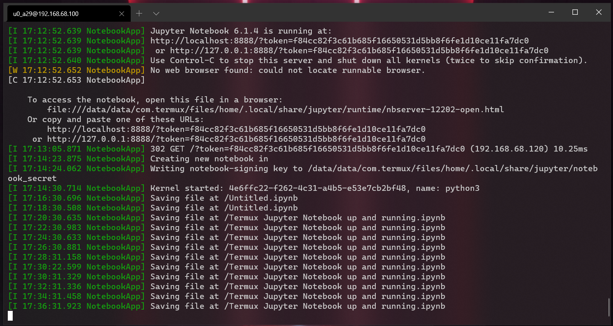
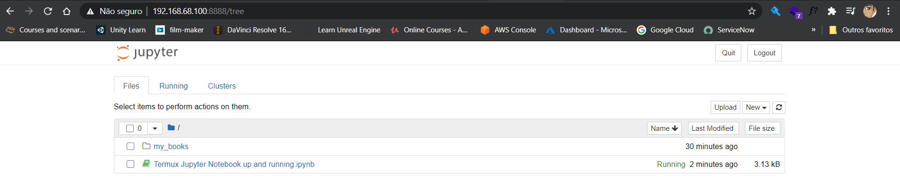
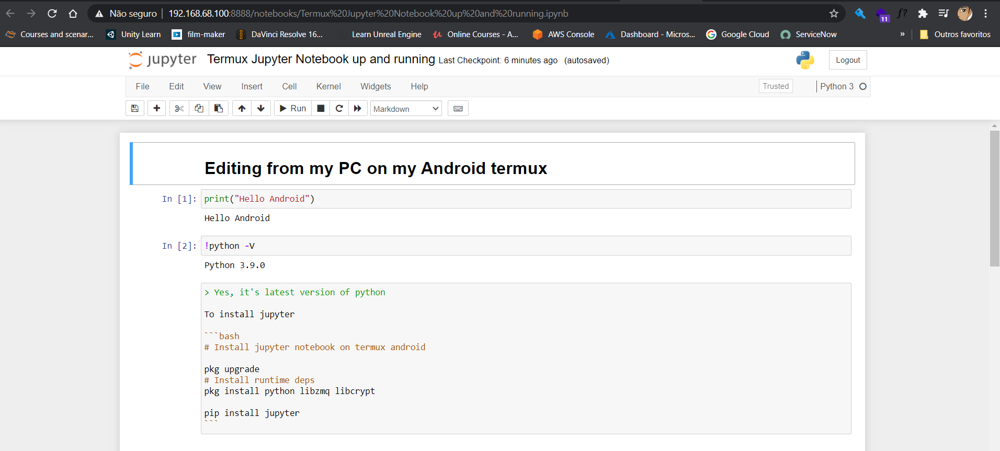

# Running Jupyter notebook on android with Termux

## TL;DR







## Notebook

File: [readme.ipynb](./readme.ipynb)

```python
print("Hello Android")
```

    Hello Android


```python
!python -V
```

    Python 3.9.0


> Yes, it's the latest version of python

To install Jupyter

```bash
pkg update && pkg upgrade

# Install runtime deps
pkg install python libzmq libcrypt

pip install jupyter
```

## Accessing your phone through ssh

### On your machine

```bash
cat ~/.ssh/id_rsa.pub # copy

# if you don't have one 
ssh-keygen -t rsa -C "your_email@example.com"
```

### On termux (Android)

```bash
# start sshd

sshd

# Getting your username. Android will create one for each app.

whoami # termux

# Discovering your IP.

ifconfig

# Set password.

passwd

# Paste your pub key to authorized_key. You can use vi or any editor available

echo <paste you public key here> ~/.ssh/authorized_keys

```

## Connecting through ssh

```bash
ssh u0_a29@192.168.68.100 -p 8022

# And start Jupyter notebook accepting a connection from any host

jupyter notebook --ip 0.0.0.0

# Copy the URL and change the 127.0.0.0 to IP discovered above
# Open it on your browser
# That's it!!
```

> Remember to keep your phone unlocked, if it's lock you'll lose your connection.

🖖 Live long and prosper.